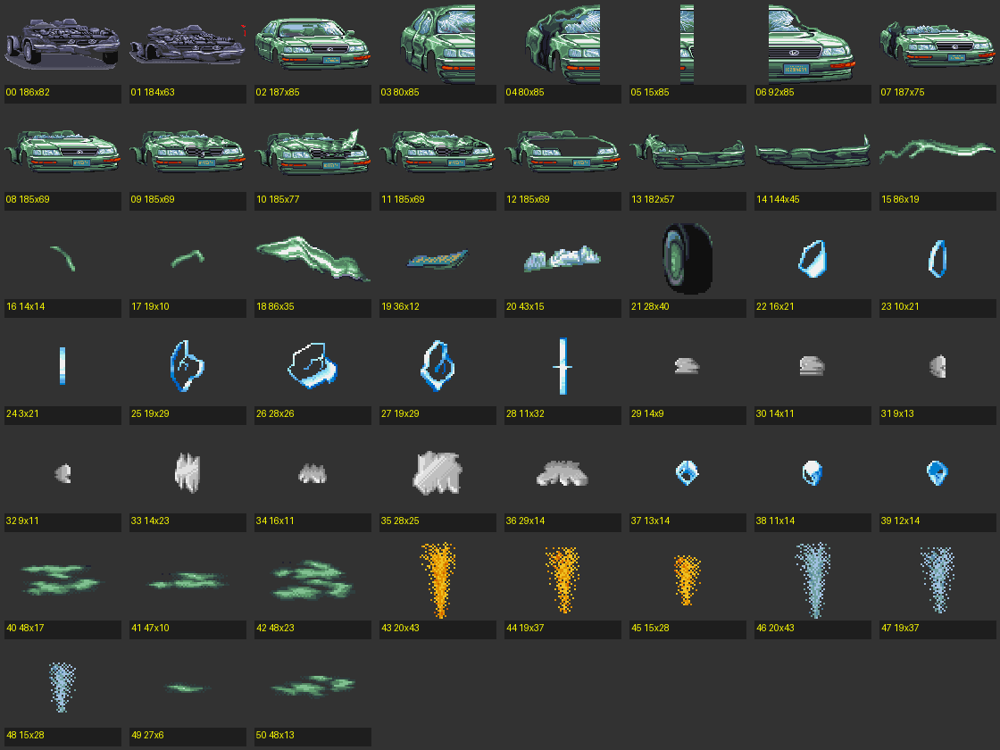

# 🕹️ Street Fighter II — Car Smash (Bonus Stage)

[](https://github.com/prof955/SF_araba)
[](https://github.com/prof955/SF_araba)
[](https://github.com/prof955/SF_araba)
[](LICENSE)

> Arcade salonlarında jetonlarımızı harcayıp Ryu ve Ken ile o meşhur arabayı parçaladığımız günlere bir **saygı duruşu (tribute)**.



---

## 🥋 Bir Çocukluk Hatırasına Saygı Duruşu

90'lı yılların efsanesi **Street Fighter II**'nin hafızalara kazınan en ikonik anlarından biri, dövüş aralarında çıkan **Bonus Stage: Araba Parçalama** bölümüydü. 

Bu proje; o dönemin arcade salonu ruhuna, piksel sanatına ve çocukluk heyecanımıza duyulan derin hayranlığın bir ürünüdür. Herhangi bir harici kütüphane veya oyun motoru kullanılmadan, tamamen **saf web teknolojileri (Vanilla JS & HTML5 Canvas)** ile modern tarayıcılara taşınmış bir sevgi projesidir.

---

## ⚡ Neler Var?

- **Orijinal CPS-1 Piksel Estetiği:** Klasik liman sahnesi, CRT scanline atmosferi ve adım adım parçalanan araç gövdesi.
- **Prosedürel Retro Sesler:** Harici ses dosyası yüklemeden, Web Audio API osilatörleriyle gerçek zamanlı üretilen 16-bit vuruş, cam ve metal efektleri.
- **Darbe & Parçacık Hissi:** Vurulan yere göre dökülen camlar, uçan kaput/tavan, fırlayan tekerlek, sarsıntı ve arcade vuruş kıvılcımları.
- **Kurulumsuz & Sıfır Bağımlılık:** Tek bir HTML dosyası; `npm`, kütüphane veya kurulum gerektirmez.

---

## 🎮 Nasıl Oynanır?

Tarayıcınızda doğrudan arabaya tıklayarak veya klavyeyi kullanarak aracı süre bitmeden parçalayın:

| Tuş | Hamle | Açıklama |
| :---: | :--- | :--- |
| **`1` / `Q`** | **Light Punch** | Hızlı yumruk |
| **`2` / `W`** | **Heavy Punch** | Ağır yumruk |
| **`3` / `E`** | **Fierce Kick** | Sert tekme |
| **`4` / `R`** | **Special Smash** | Özel güçlü darbe |
| **`Space`** | **Seri Vuruş** | Hızlı saldırı |
| **Fare Tıklaması** | **Noktasal Darbe** | Tıkladığınız bölgeye (kapı, cam, kaput, tavan) doğrudan hasar verir |

---

## 🚀 Çalıştırma

Herhangi bir kurulum gerekmez:

1. Repoyu indirin veya klonlayın:
   ```bash
   git clone https://github.com/prof955/SF_araba.git
   ```
2. **`index.html`** dosyasını herhangi bir web tarayıcısında çift tıklayarak açın.

---

## 📜 Saygı & Yasal Uyarı

Street Fighter, logo ve görsel materyaller **Capcom Co., Ltd.**'ye aittir. Bu çalışma yalnızca hayranlık ve nostalji amacıyla geliştirilmiş, kâr amacı gütmeyen açık kaynaklı bir tribute projesidir.
